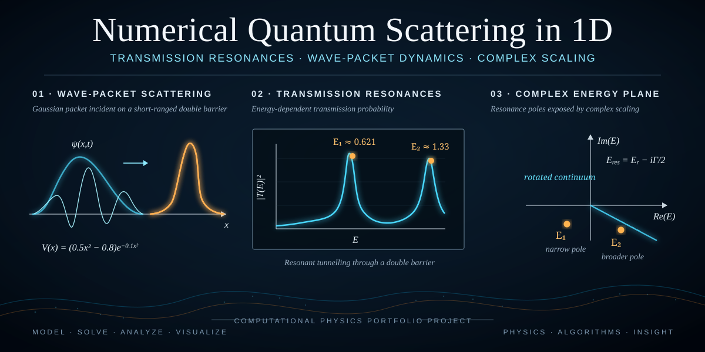
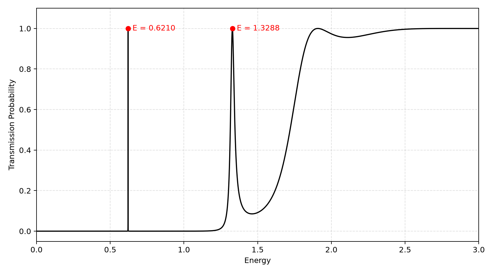
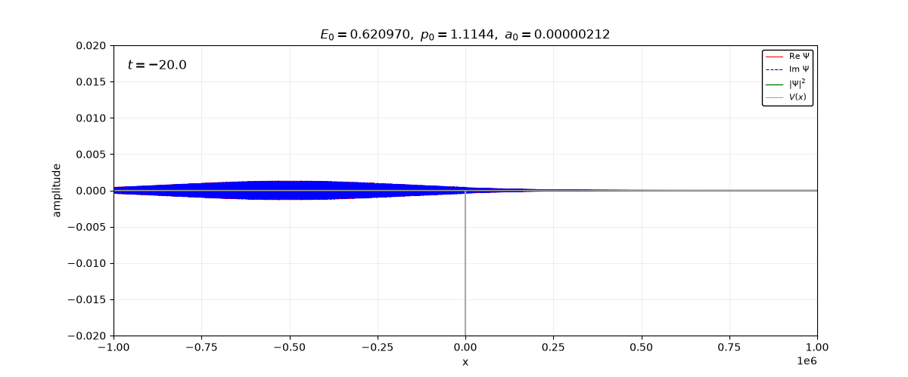
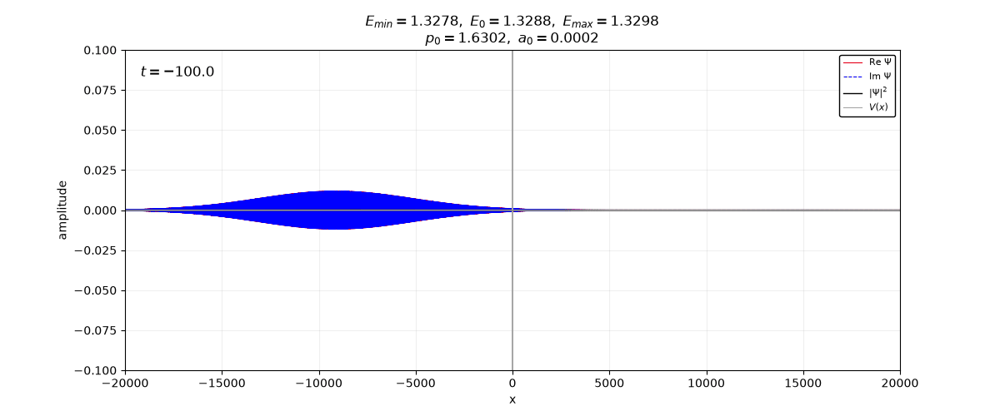
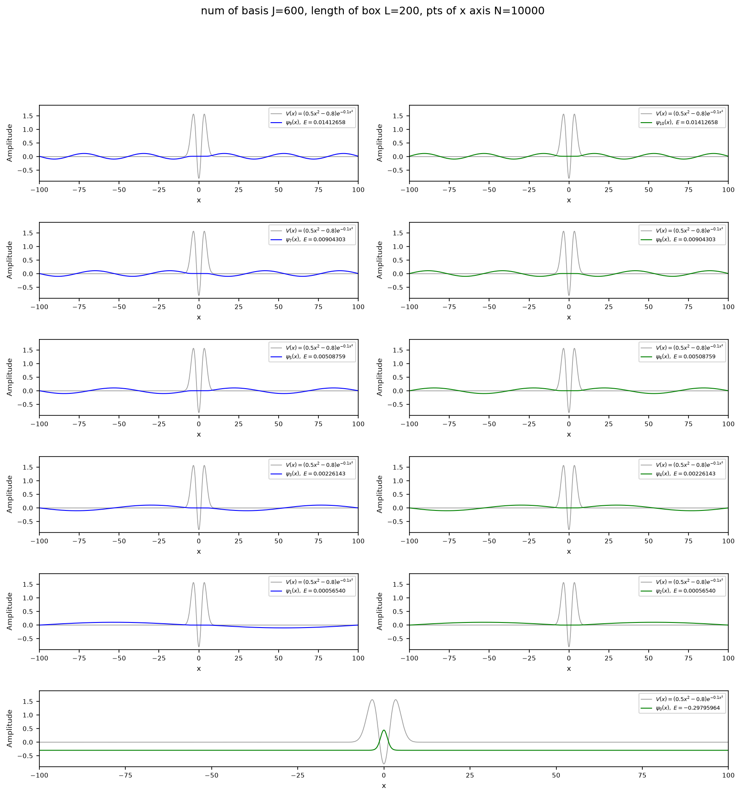
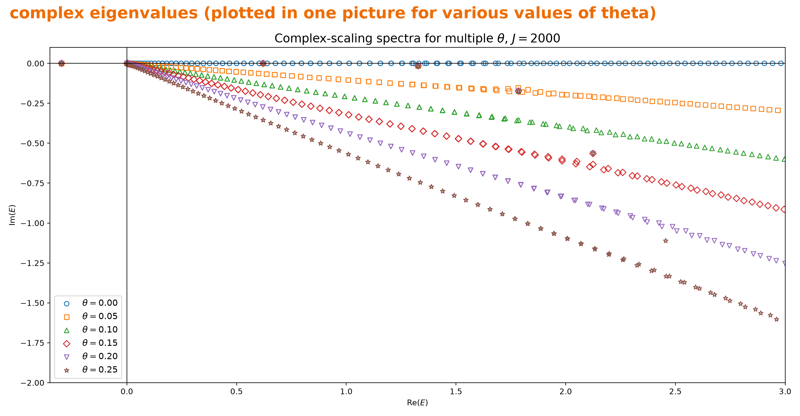
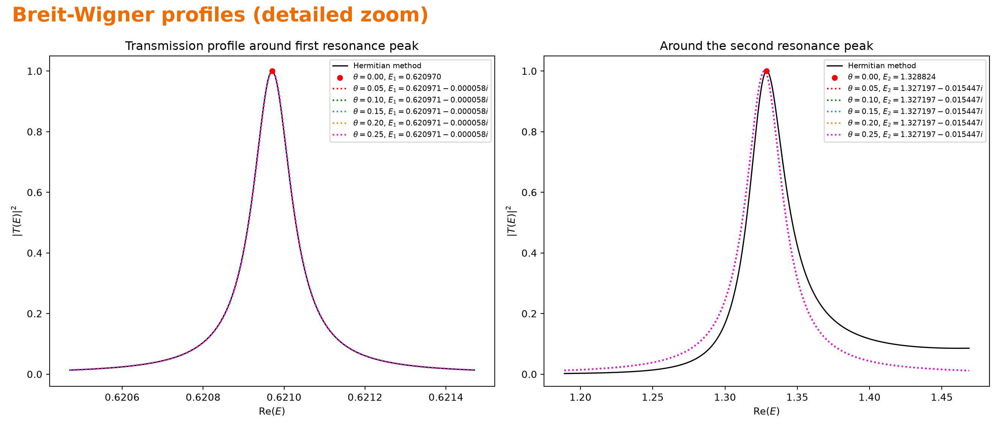
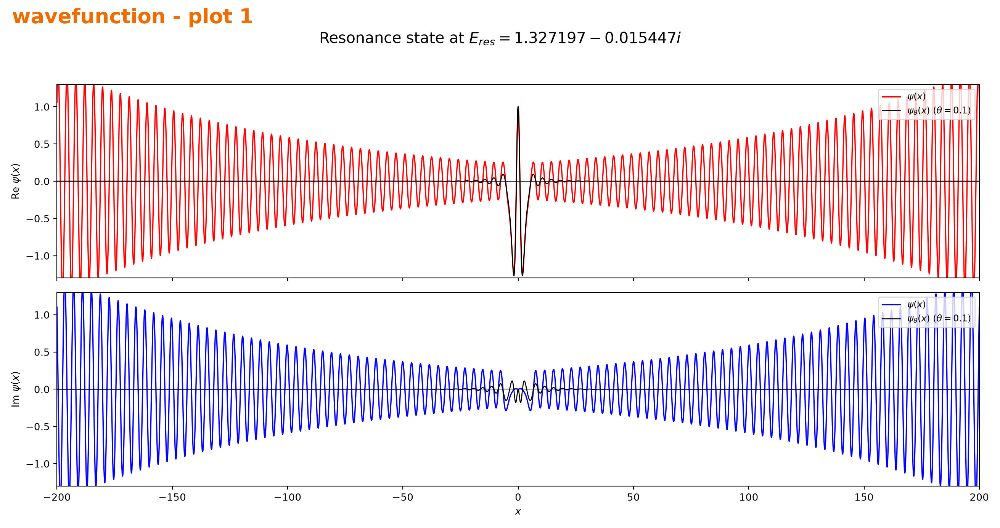

<div align="center">

# Numerical Quantum Scattering in 1D

**Transmission resonances · wave-packet dynamics · complex scaling**

An individual computational-physics project comparing conventional Hermitian scattering calculations with a non-Hermitian resonance description based on Siegert-state ideas.

[**Final report (PDF)**](report/quantum_scattering_report.pdf) · [**Editable report (DOCX)**](report/quantum_scattering_report.docx) · [**Source code**](code/) · [**Selected figures**](figures/)

</div>

---

## Project at a glance

| | |
|---|---|
| **Problem** | How does a quantum particle transmit through a short-ranged double-barrier potential, and why do sharp transmission peaks appear? |
| **Main observable** | Energy-dependent transmission probability $|T(E)|^2$ |
| **Conventional route** | Finite-difference stationary scattering + Gaussian wave-packet propagation |
| **Resonance route** | Finite-basis diagonalization + complex scaling + complex resonance energies |
| **Main comparison** | Transmission peaks obtained in ordinary scattering are matched to resonance poles in the complex-energy plane |
| **Implementation** | Python, NumPy, SciPy, Matplotlib |

The model potential is

$$
V(x)=(0.5x^2-0.8)e^{-0.1x^2}, \qquad m=\hbar=1.
$$

The numerical transmission scan contains two prominent low-energy resonances near

$$
E_1\approx0.621, \qquad E_2\approx1.33.
$$

The non-Hermitian calculation exposes corresponding complex poles. For the two main resonances, representative values are approximately

$$
E_1^{\rm res}\approx0.620971-0.000058i,
$$

$$
E_2^{\rm res}\approx1.327197-0.015447i.
$$

Their real parts locate the resonances, while the negative imaginary parts encode their widths and lifetimes.

---

## Selected results

### 1. Transmission resonances from the conventional scattering calculation



A direct finite-difference solution of the stationary Schrödinger equation gives the full transmission curve. The two sharp peaks are the central numerical feature that the later parts of the project seek to explain.

### 2. Time-domain picture: resonant tunnelling of Gaussian packets

<p align="center">
  
  
</p>

Narrow-band Gaussian wave packets centered near the two resonance energies are propagated through the potential. This connects the stationary transmission coefficient to an intuitive collision picture in the time domain.

### 3. Finite-basis view of bound and continuum-like states



The Hamiltonian is represented in a particle-in-a-box basis and diagonalized numerically. Negative-energy states remain localized, while positive-energy states discretize the continuum. Some positive-energy box states appear close to the transmission-resonance energies.

### 4. Complex scaling reveals resonance poles

<p align="center">
  
  
</p>

When the coordinate is complex-scaled, the discretized continuum rotates into the lower half of the complex-energy plane, while isolated resonance eigenvalues remain approximately stationary. The first resonance is extremely narrow and is very well described by an isolated Breit-Wigner profile; the second is broader and shows a stronger non-resonant background.

### 5. Resonance wavefunction before and after complex scaling



A Siegert resonance satisfies outgoing boundary conditions and therefore grows asymptotically on the real axis. Complex scaling rotates that exponential growth into decay, making the resonance numerically accessible with a square-integrable basis.

---

## What I implemented

- A finite-difference solver for 1D stationary scattering and extraction of transmission/reflection amplitudes.
- Automatic scanning and refinement of resonance peaks in $|T(E)|^2$.
- Gaussian wave-packet construction and time-dependent scattering visualizations.
- Particle-in-a-box basis construction and Hamiltonian diagonalization.
- Complex-scaled Hamiltonians and complex eigenvalue spectra for several rotation angles.
- Tracking of approximately angle-stable resonance eigenvalues.
- Breit-Wigner line-shape comparison between resonance poles and the direct transmission calculation.
- Visualization of resonance wavefunctions before and after complex scaling.
- A single `run_all.py` entry point for reproducing Parts 1–6.

This project therefore combines **quantum mechanics, numerical linear algebra, boundary-value problems, Fourier methods, complex eigenvalue problems, and scientific visualization** in one reproducible workflow.

---

## Numerical workflow

```text
Free Gaussian wave packet
        ↓
Regularized delta function
        ↓
Stationary scattering: T(E), R(E)
        ↓
Wave-packet scattering near/off resonance
        ↓
Finite-box Hamiltonian diagonalization
        ↓
Complex scaling and complex spectrum
        ↓
Resonance poles → widths → Breit-Wigner peaks
```

The project deliberately uses several complementary numerical representations of the same physical system instead of relying on a single black-box calculation.

---

## Repository structure

```text
.
├── README.md
├── assets/
│   └── portfolio-cover.svg
├── code/
│   ├── part1_free_gaussian.py
│   ├── part2_regularized_delta.py
│   ├── part3_stationary_scattering.py
│   ├── part4_wavepacket_scattering.py
│   ├── part5_box_basis.py
│   ├── part6_complex_scaling.py
│   ├── part6_resonance_wavefunctions.py
│   ├── run_all.py
│   ├── requirements.txt
│   └── quantum_scattering/
│       ├── core.py
│       ├── scattering.py
│       ├── box_basis.py
│       └── complex_scaling.py
├── figures/                 # selected results for quick review
└── report/
    ├── quantum_scattering_report.pdf
    └── quantum_scattering_report.docx
```

The portfolio version intentionally keeps only the material needed to understand the project: source code, selected figures, and the final report. Lecture handouts, instructor whiteboard scans, temporary diagnostics, and unrelated student files are excluded.

Generated outputs are written to `code/outputs/` and are ignored by Git so that the repository remains compact and reproducible.

---

## Reproduce the project

```bash
python -m venv .venv

# Windows
.venv\Scripts\activate

# macOS / Linux
source .venv/bin/activate

pip install -r code/requirements.txt
python code/run_all.py --quick --skip-gifs
```

`--quick` uses reduced numerical settings for a fast sanity check. Remove it for the full-resolution calculations. Remove `--skip-gifs` to regenerate the wave-packet animations.

### Dependencies

- NumPy
- SciPy
- Matplotlib
- Pillow

---

## Reference

- M. Sindelka, *An Introduction to Scattering Theory*, arXiv:2204.03651.

---

## Author

**Shufan Zhang**
